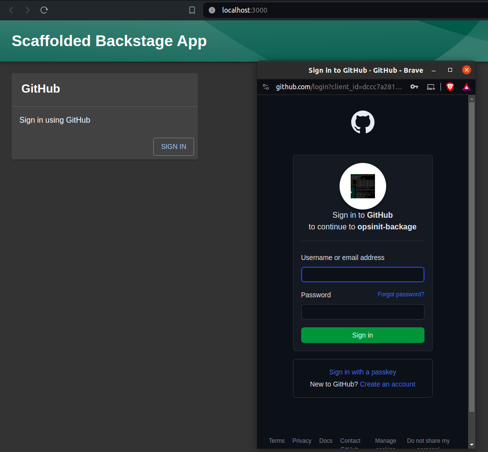

# [Backstage](https://backstage.io)
- Backstage is an open-source framework for building developer portals. ​
- Backstage unifies all your infrastructure tooling, services, and documentation to create a streamlined development environment from end to end.

This techhub template focuses on setting up a starter backstage application and configuring github auth provider for sso. </br>

# Pre-requisite
- nvm, node, yarn
- node version >=18

# How to use
- create an organization on github.
- Go to developer settings, setup OAuth apps and retrive CLIENT_ID and CLIENT_SECRET.
- Copy CLIENT_ID and CLIENT_SECRET to `.env` file.
- Run `source .env` to setup environment variable.
- Run `nvm use 18` to ensure node version is atleast 18.
- To start the app, run:
    ```
    yarn install
    yarn dev
    ```
- Backstage app will load up on `http://localhost:3000/`



NOTE: To setup application from scratch refer, https://backstage.io/docs/getting-started/

# What's needed for github auth setup,
1. `backstage-main/packages/app/src/components/signin`
    Setup github identity providers. </br>
2. `app-config.yaml`
    Setup `auth` and `integrations` for github with secrets retrived from OAuth. </br>

